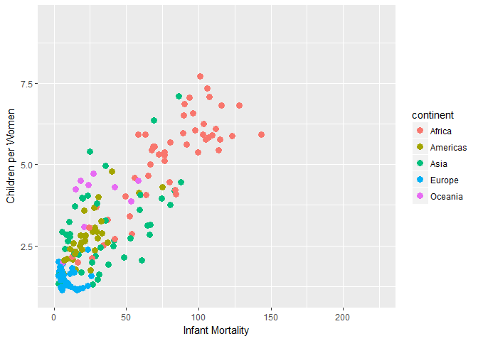
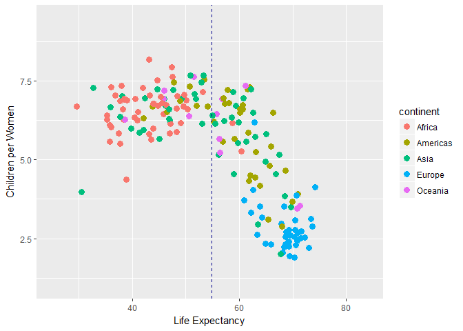
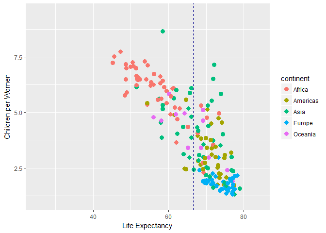
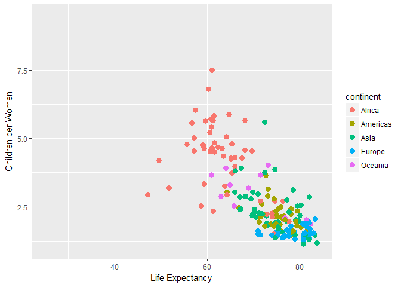

A High-Level Introduction to Shiny with Gapminder
================
Jon Wayland
October 19, 2018

Gapminder Data
--------------

Before getting into the Gapminders data, we need to install/load a few packages. To see what packages we already have installed, we can simply use the command `rownames(installed.packages())`. If a package that we need isn't available, we use the command `install.packages(<PACKAGE NAME>)`. To load the library, we use `library(<PACKAGE NAME>)`.

Another way to go about this is to first define our needed packages as strings in an array (`c()` in R) and then loop through them checking to see if they exist, and if not, installing them and then ultimately loading them. The following block of code does this on the array defined as `pack`:

``` r
# Set packages we want to use
pack<-c(
  "dslabs",
  "tidyverse",
  "data.table",
  "shiny"
) 

# If packages exist then load them, otherwise install them first
for(i in 1:length(pack)){
  if(pack[i] %in% rownames(installed.packages()) == FALSE) {
    install.packages(pack[i])
  }
}
for(i in 1:length(pack)){
  lapply(pack[i], require, character.only = TRUE)
}
```

### Gapminder data

The Gapminder data is one of many datasets that are available in the `dslabs` package. Gapminder is an organization that collects and analyzes world data: <https://www.gapminder.org/>. The late Hans Rosling gave an incredible TED Talk on the data we will be playing with that really portrays how the health of our world has increased through time. It can be seen here: <https://www.ted.com/talks/hans_rosling_shows_the_best_stats_you_ve_ever_seen?language=en>

We can create a <i>data frame</i> object in R named `data` through specifying we want the `gapminder` data out of the `dslabs` package.

``` r
data<-dslabs::gapminder
```

We can see what variables are included in the data by using the `head` function:

``` r
head(data)
```

    ##               country year infant_mortality life_expectancy fertility
    ## 1             Albania 1960           115.40           62.87      6.19
    ## 2             Algeria 1960           148.20           47.50      7.65
    ## 3              Angola 1960           208.00           35.98      7.32
    ## 4 Antigua and Barbuda 1960               NA           62.97      4.43
    ## 5           Argentina 1960            59.87           65.39      3.11
    ## 6             Armenia 1960               NA           66.86      4.55
    ##   population          gdp continent          region
    ## 1    1636054           NA    Europe Southern Europe
    ## 2   11124892  13828152297    Africa Northern Africa
    ## 3    5270844           NA    Africa   Middle Africa
    ## 4      54681           NA  Americas       Caribbean
    ## 5   20619075 108322326649  Americas   South America
    ## 6    1867396           NA      Asia    Western Asia

We can see that we have infant mortality, life expectancy, fertility, population, gdp, continent, and region all by year for each country. We can also summarize the data with `summary()`:

``` r
summary(data)
```

    ##                 country           year      infant_mortality
    ##  Albania            :   57   Min.   :1960   Min.   :  1.50  
    ##  Algeria            :   57   1st Qu.:1974   1st Qu.: 16.00  
    ##  Angola             :   57   Median :1988   Median : 41.50  
    ##  Antigua and Barbuda:   57   Mean   :1988   Mean   : 55.31  
    ##  Argentina          :   57   3rd Qu.:2002   3rd Qu.: 85.10  
    ##  Armenia            :   57   Max.   :2016   Max.   :276.90  
    ##  (Other)            :10203                  NA's   :1453    
    ##  life_expectancy   fertility       population             gdp           
    ##  Min.   :13.20   Min.   :0.840   Min.   :3.124e+04   Min.   :4.040e+07  
    ##  1st Qu.:57.50   1st Qu.:2.200   1st Qu.:1.333e+06   1st Qu.:1.846e+09  
    ##  Median :67.54   Median :3.750   Median :5.009e+06   Median :7.794e+09  
    ##  Mean   :64.81   Mean   :4.084   Mean   :2.701e+07   Mean   :1.480e+11  
    ##  3rd Qu.:73.00   3rd Qu.:6.000   3rd Qu.:1.523e+07   3rd Qu.:5.540e+10  
    ##  Max.   :83.90   Max.   :9.220   Max.   :1.376e+09   Max.   :1.174e+13  
    ##                  NA's   :187     NA's   :185         NA's   :2972       
    ##     continent                region    
    ##  Africa  :2907   Western Asia   :1026  
    ##  Americas:2052   Eastern Africa : 912  
    ##  Asia    :2679   Western Africa : 912  
    ##  Europe  :2223   Caribbean      : 741  
    ##  Oceania : 684   South America  : 684  
    ##                  Southern Europe: 684  
    ##                  (Other)        :5586

### dplyr and ggplot2

The `dplyr` package is a great data-structuring package that can be used to perform SQL-like queries on an R data frame. The scope of this tutorial is not to show `dplyr` actions, but as a quick definition, here are some useful verbs:
<ul>
<li>
`select()`: select columns
</li>
<li>
`filter()`: create filters on selected columns
</li>
<li>
`arrange()`: order selected columns
</li>
<li>
`mutate()`: create columns or transform existing columns
</li>
</ul>
There are more, but the above are some of the most widely used. Another important concept from `dplyr` is the pipe operator `%>%`. This operator allows you to do actions on the data in a sequential fashion, where each action occurs in order based on the order of the pipe operators.

For example, we can visualize the data for the year 2000 on the relationship between infant mortality and fertility rate (children per women) by taking the data frame object, piping into the `filter()` command and then piping into the `ggplot()` function. The `aes()` command represents an <i>aesthetic</i> wrapper that specifies the variables from the data frame object that we want to visualize. To see all argument options and geometric capabilities, see <https://ggplot2.tidyverse.org/reference/>.

``` r
data %>% filter(year == 2000) %>%
  ggplot(aes(x = infant_mortality, y = fertility, color = continent)) +
  geom_point(size = 3)+
  scale_x_continuous(limits = c(0,225))+
  scale_y_continuous(limits = c(1,9.5))+
  ylab("Children per Women")+
  xlab("Infant Mortality")
```

    ## Warning: Removed 7 rows containing missing values (geom_point).



You might have noticed that there are a few variable components from the code that produced the above plot. The `year`, `x`, `y`, and `color` arguments are all variable. Let's focus solely on the `year` variable. Suppose we wanted to see the relationship between the `fertility` column and the `life_expectancy` column through time. Accomplishing this can be easy nwo that we have determined the only item that is variable is the time.

So, we can create a function that takes `year` as an argument and plots our columns of interest against eachother for the year specified. Let's call it `gapPlot()`:

``` r
gapPlot<-function(Year){
  # Adding in mean lines
  meanCalc<-function(Year){mean(data$life_expectancy[data$year == Year])}
  
  data %>% filter(year == Year) %>%
    ggplot(aes(x = life_expectancy, y = fertility, color = continent)) +
    geom_point(size = 3)+
    scale_x_continuous(limits = c(25,84))+
    scale_y_continuous(limits = c(1,9.5))+
    ylab("Children per Women")+
    xlab("Life Expectancy")+
    geom_vline(xintercept = meanCalc(Year), lty = 2, color = "darkblue")
}
```

Testing it out we can that the plots change according to the specified year:

``` r
gapPlot(1960)
```



``` r
gapPlot(1990)
```



``` r
gapPlot(2015)
```

    ## Warning: Removed 1 rows containing missing values (geom_point).



So the next question becomes <b>how do we visualize this relationship through time?</b> Well, we could simply plot each year between 1960 and 2015 next to eachother, but that would be an eyesore. A better way to do this is to create a `shiny` app.

### Shiny Apps

Creating a web app with `shiny` can be very easy and straightforward. At the simplest level, `shinyApp()` function from the `shiny` package takes 2 arguments:
<ol>
<li>
ui: The user interface can easily leverage the `fluidPage` function to create the look and feel of the web page.
</li>
<li>
server: The server is simply a function of inputs and outputs that displays the data elements. In our case, they are generating graphics from the `gapPlot` function we defined previously.
</li>
</ol>
``` r
server <- function(input, output) {
  
  # Creating a formula for the text that will appear on screen
  formulaText <- reactive({
    paste("Fertility vs. Life Expectancy for ", input$variable, sep = "")
  })
  
  # Return the formula text for printing as a caption 
  output$caption <- renderText({
    formulaText()
  })
  
  # Generate a plot of the requested year
  output$PlotA <- renderPlot({
    gapPlot(input$variable)
  })
}

ui <- fluidPage(
  # App title
  titlePanel("Gapminder Data App"),
  
  # Sidebar layout with input and output definitions 
  sidebarLayout(
    
    # Sidebar panel for inputs
    sidebarPanel(
      # Input: Slide bar for year
      sliderInput("variable", 
                  "Year:", 
                  min = 1960, 
                  max = 2015, 
                  value = 1,
                  step = 1,
                  animate = animationOptions(interval = 900, loop = FALSE),
                  sep = "")
      
    ),
    
    # Main panel for displaying outputs
    mainPanel(
      
      # Output: Formatted text for caption
      h3(textOutput("caption")),
      
      # Output: Plot of the fertility vs. life expectancy
      plotOutput("PlotA")
    )
  )
)
```

Again, executing the shiny app we just built can be done with the `shinyApp()` function.

``` r
shinyApp(ui, server)
```

Unfortunately, Shiny applications are not supported in static R Markdown documents, and so thus we cannot play with the final product without actually running the code. If you are following along, you will be able to see the below. Clicking the play button will show you the relationship between fertility rates and life expectancy by country through time.


